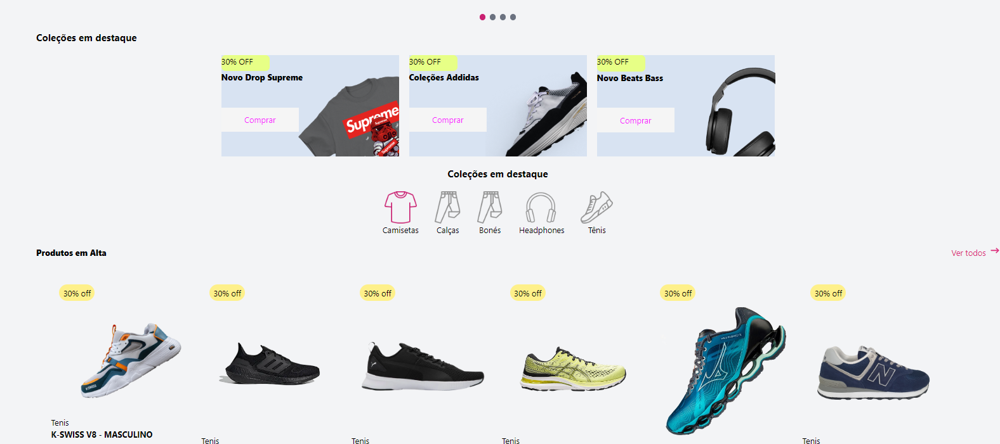
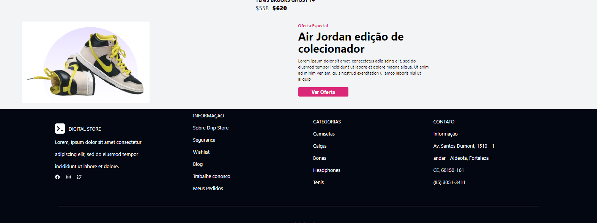
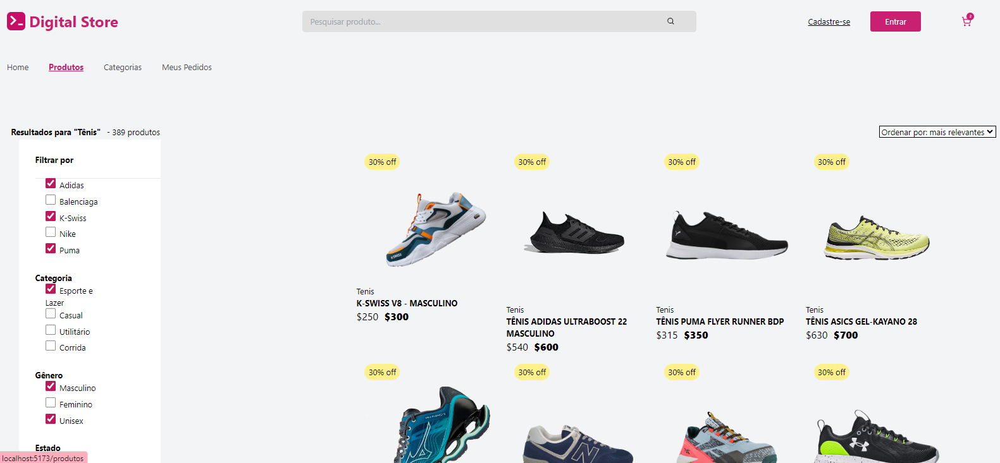
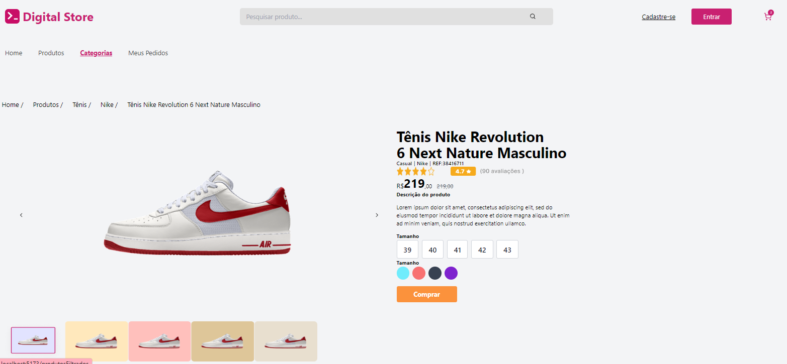

<h1 align="center"> PROJETO FRONT END - DIGITAL COLLEGE </h1>

Projeto exclusivo da digital college promovido pelo programa geração tech. Que tem o objetivo de testar os conhecimentos sobre front-end.

  <a href="#-tecnologias">Tecnologias</a>&nbsp;&nbsp;&nbsp;|&nbsp;&nbsp;&nbsp;
  <a href="#-projeto">Projeto</a>&nbsp;&nbsp;&nbsp;|&nbsp;&nbsp;&nbsp;
  <a href="#-layout">Layout</a>&nbsp;&nbsp;&nbsp;

 

## 🚀 Tecnologias

Esse projeto foi desenvolvido com as seguintes tecnologias:

- React
- JavaScript
- Git 
- Tailwind

## 💻 Projeto

Geração Tech é um projeto do governo do estado do ceará que tem como objetivo preparar jovens para trabalhar no mundo da tecnologia. É um curso intensivo onde tem parceria com a Digital College. Uma escola de tecnologia muito reconhecida em Fortaleza que forma pessoas para o mercado de trabalho em um curto período de tempo.

 

## 🔖 Layout

Você pode visualizar o layout do nosso projeto logo abaixo nas imagens. Desenvolvemos essa página de DRIP STORE utilizando as tecnologias acima citadas. Somos uma equipe de 5 pessoas, cada integrante fez uma parte de cada página web e fomos compartilhando as informações através do GitHub.

 

  
   
  
   
  
   
  
   
  

